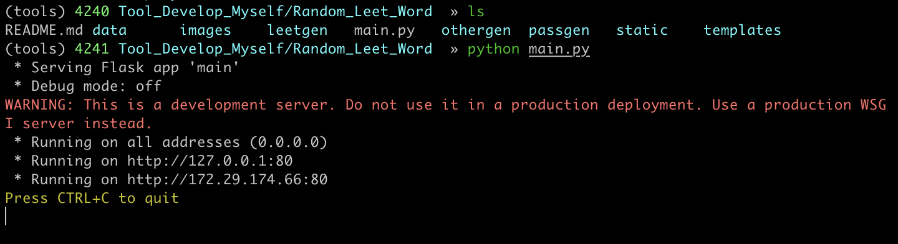
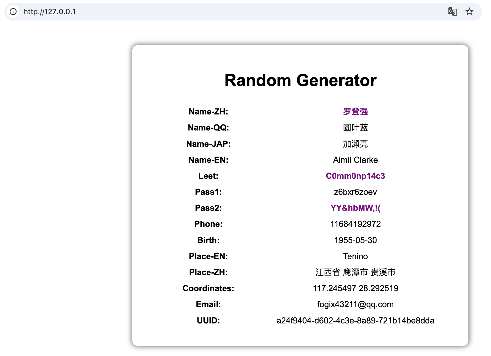
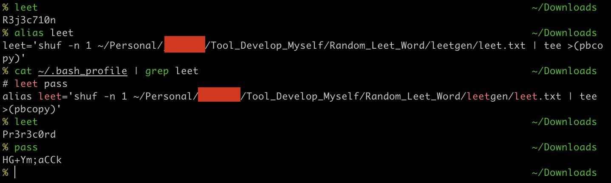

## 说明

```shell
# 安装
git clone https://github.com/N1h1l157/randominfo.git

```

## 使用截图

```shell
# 使用
python main.py
```



刷新页面即可获取新的字符：




## 终端生成随机leet

```shell
# 在～/.bash_profile中添加别名
leet='shuf -n 1 ~/Personal/xxx/Tool_Develop_Myself/Random_Leet_Word/leetgen/leet.txt | tee >(pbcopy)'

# 使用终端直接输入命令 leet 或者 pass
leet
```


